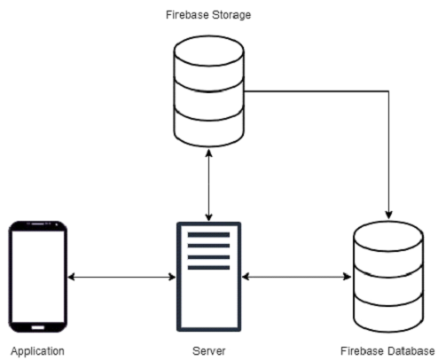
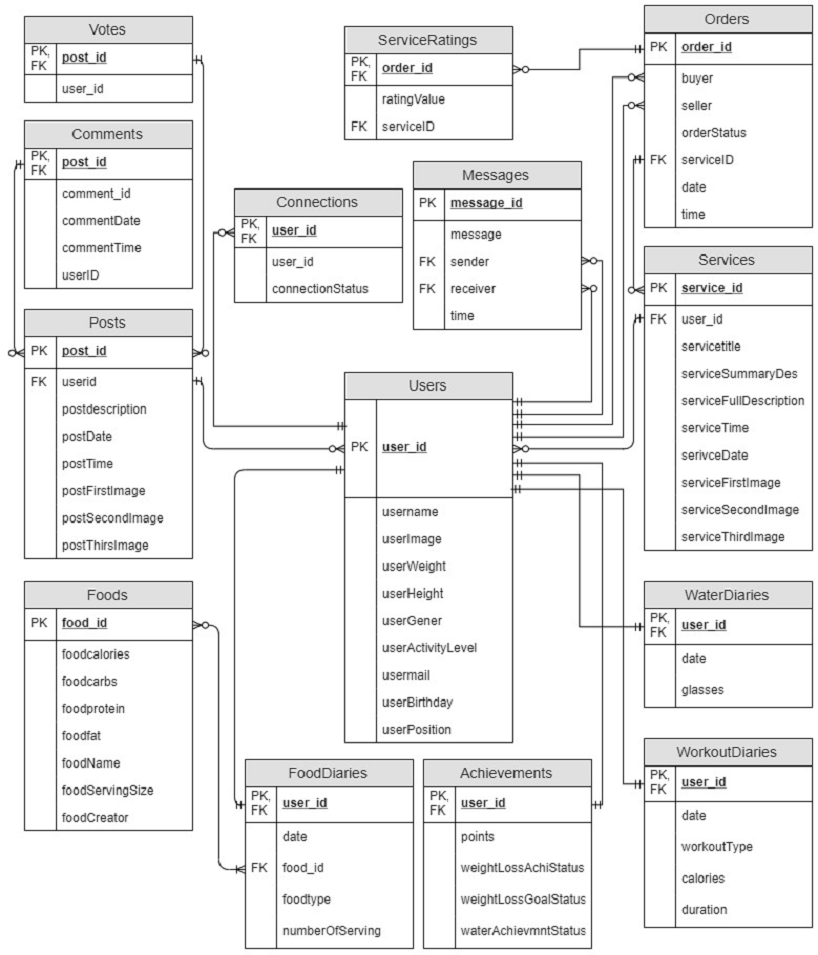
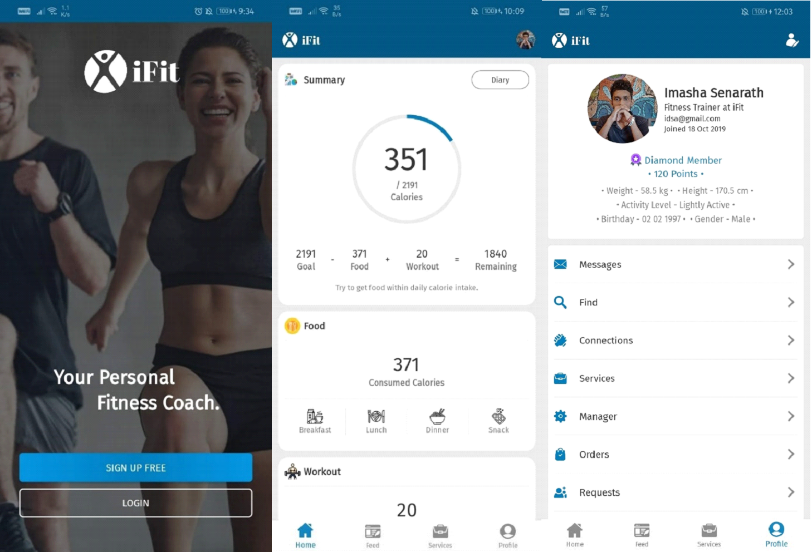

# Fitness Android Application - iFit

[iFit Web Site](https://ifit-coach.netlify.app/)

Today, people spend more money on non-communicable diseases more than any other. Unhealthy diet and physical inactivity are primary factors for non-communicable diseases. 
But most of the people’s lives are so busy today. In that case, people don’t have enough time to consider their health & fitness. So, this project involved developing an 
android application that can help to maintaining health and increase fitness level, because most people have their mobile phones on them always. So, the mobile application 
is an easy option for maintaining healthy life and increasing fitness level. By using this application,

- User can meet professionals and get services from them through the application instead of meeting physically over a place.
- Professionals can provide services and the users can find and identify experienced professionals.
- User can interact with the huge community that related to health and fitness. So, if user in trouble, they can ask question from the community.
- User can learn a lot of things related to health and fitness from the community. So, it improves knowledge of a healthy lifestyle.
- Save time and money.
- User can track their fitness level and able to do something to increase it.
- People can find food nutrition and proper diet plans.
- Motivate people to consider about their fitness & health.

## Used Technologies

Android is the chosen platform for the project application. There are more android application development technologies and tools widely used to develop an effective 
and quality application. Choosing development technology is a most important decision that before starting the project.  So, the project was conducted more researches 
and choose the most suitable technologies for this project. Below describes the primary technologies and tools that project has chosen.

- **Android Studio** – Android Studio is the Integrated Development Environment for especially android application development.  The development was undertaken using this IDE. It was chosen because it is the official android development IDE and it has many useful features than other IDEs. It uses the quick growing Gradle build system. It is great tool. Also, it has better auto code completion feature than other IDEs. Android studio has user friendly user interface. It is the main reason that project chose android studio. So, it helps to use very easier and organize the project.  
- **AVD Manager** – AVD stands for Android Virtual Device Manager.  It is the built-in tool of Android studio. This allows to test application on several virtual devices that has different characteristics such as hardware profile, storage area, appearance, system image. So, this tool helped a lot to check this application on serval devices without any physical devices.
- **Java** – Java and Kotlin are official languages of android development. Both are support to android studio. But in the android development, the most popular option is java.  Also, java applications are lighter and more compact compare to Kotlin application. Development of the Firebase database connection more suitable with java language because there was greater support and help documentation for Java than Kotlin. So, the project chose java language as the primary backend language.
- **Firebase** Real-time Database – Firebase is mobile and web app development platform by google. It provides a lot of services. The firebase real-time database is a NoSQL cloud-hosted database for web application and mobile application.  The project chose the firebase real-time database as an application database. It was chosen because it has more advantages and easy to use than SQL databases. Mainly it is a totally free database. In the firebase database, data is stored as JSON and sync data in real-time across every connected device. The firebase database can access directly from a mobile application or web application without application server. 
- **Firebase Storage** – This application needs store images and share with all users that use this application. So, the project chose firebase storage. Firebase storage is a part of the firebase real-time database. It is designed to easily store images, videos etc. 
- **XML** – XML stands for Extensible Markup Language.  Basically, it mainly uses for user interface and layout design. But there are many XML file types for different proposes.  Layout XML files, manifest XML file, strings XML files, styles XML files, drawable XML files and animation XML files are XML files that I used for this project. So, the project chose xml for frontend design.

## System Architecture

The diagram below shows the basic architecture of the system. It represents the main components and how they are connected. The main components are as follows: Application, firebase server, firebase database and firebase storage.

## Database Design

Google firebase database is the database that used to this application. But firebase is a NoSQL database. It is a JSON database and there are no tables or joins. So, firebase database was not directly applicable to the entity relationship diagram. Therefore, the firebase database structure (JSON Structure) should convert to the SQL structure with primary and foreign keys. The diagram below shows the converted structure of the firebase database.

## Application Screenshots

