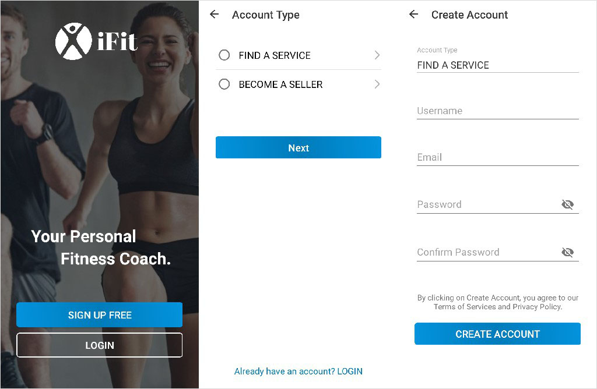
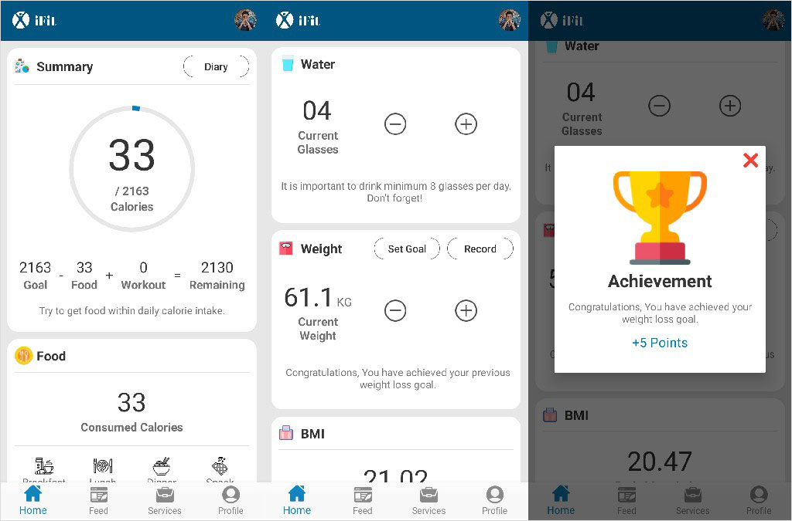
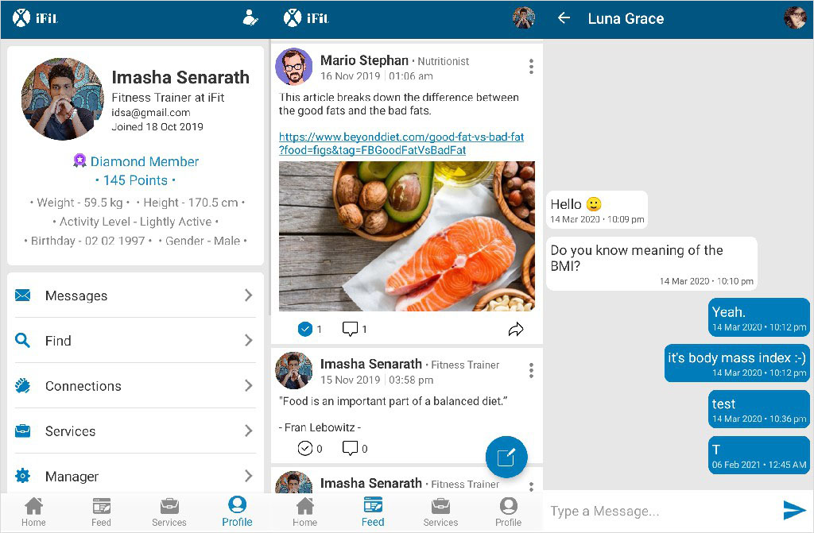

# Fitness Android Application - iFit

An android fitness application that can help to maintaining health and increase fitness level. By using this application,

- User can meet professionals and get services from them through the application instead of meeting physically over a place.
- Professionals can provide services and the users can find and identify experienced professionals.
- User can interact with the huge community that related to health and fitness. So, if user in trouble, they can ask question from the community.
- User can learn a lot of things related to health and fitness from the community. So, it improves knowledge of a healthy lifestyle.
- Save time and money.
- User can track their fitness level and able to do something to increase it.
- People can find food nutrition and proper diet plans.
- Motivate people to consider about their fitness & health.

[iFit Web Site](https://ifit-coach.netlify.app/)

## Screenshots

